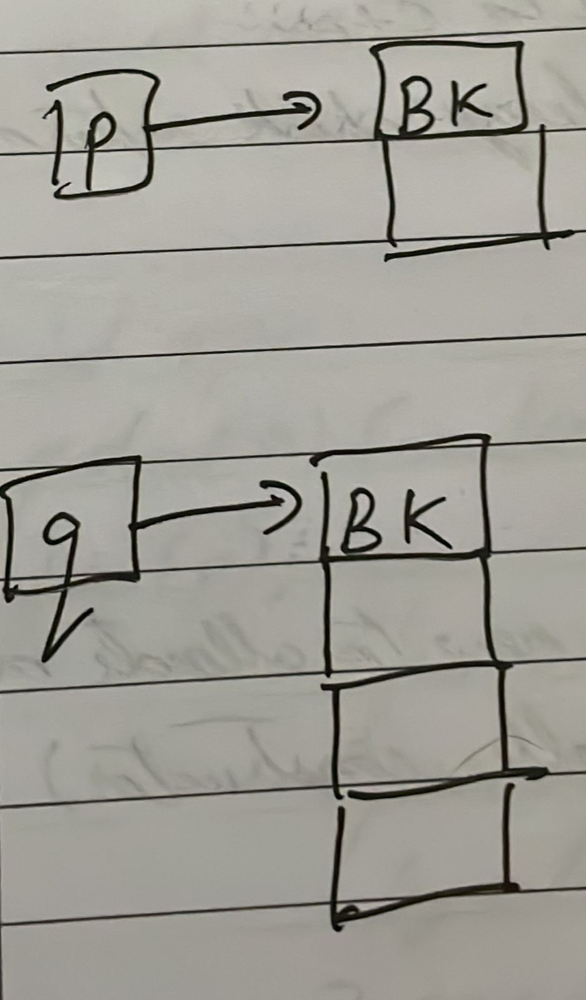
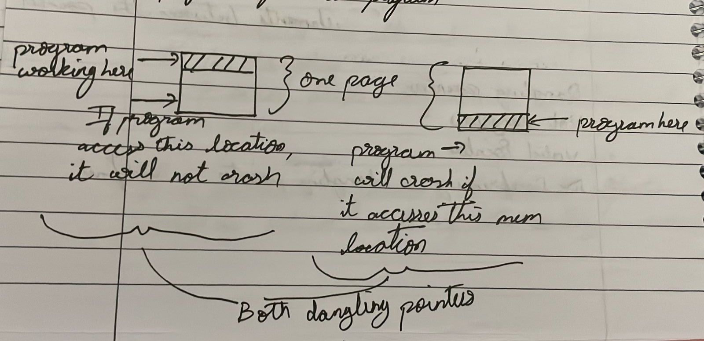
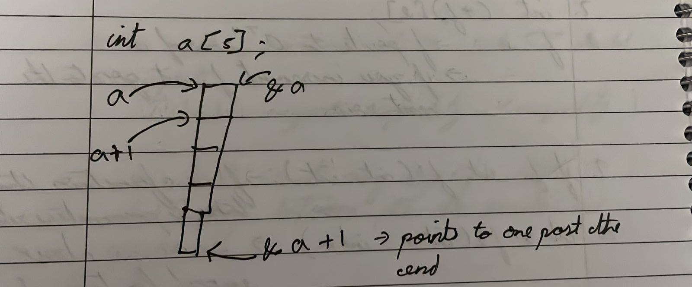
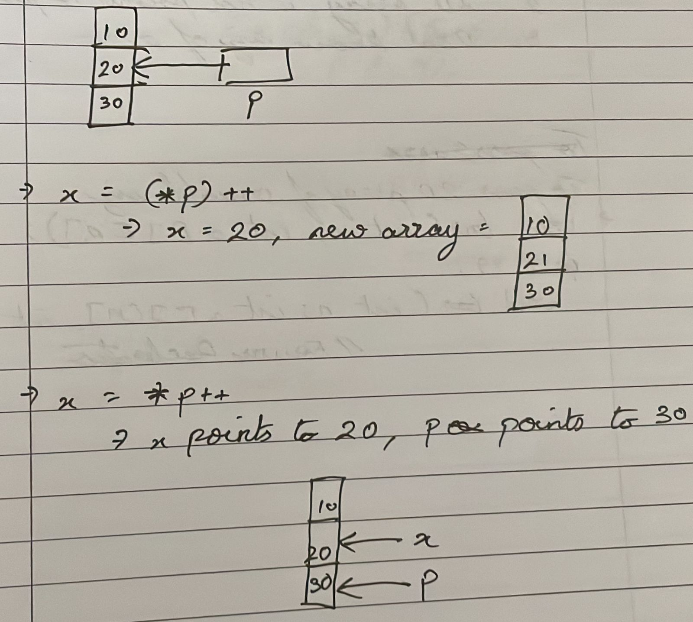

# Unit 1
## Introduction
- Important to differentiate `how` vs `what`
- Important to know the difference between `interface` and `implementation`

## Object Oriented Languages
- Constructor is called when an object is created
    - Constructor is used for initialization and resource acquiring

- Destructor is called when an object dies
    - Destructor is used for deinitialization and freeing of resources
    - Frees and manages a lot of resources, example: mutex locks, semaphores,
    shares resources, etc
        - This is why constructors and destructors are important, language
          needs to know how to handle the resources

    - Garbage collector works with managing memory on deletion of object
    - When an exception occurs, stack is unwound and catch block is executed
    and destructor is called
        - `try` has a dynamic scope

- Language knows only *when* to call constructor and destructor, but does not
   know *how* to use them

## Garbage Collectors
- Garbage collectors are used to manage memory
    - Garbage is unaccessible memory. The memory has a location, but no access
    - This is opposite of `dangling pointer` who have access but no location

### Philosophy of garbage collectors in various languages
- Java
    - Allows creation of garbage
    - When memory falls below a threshold, spawn a garbage collector thread
    which has low priority
    - This goes through the data segment and then assumes the entire heap is
    garbage and tries to search if a memory location is references from the
    data segment
    - If it is, then it is marked as useful
    - This method is called `mark and sweep`
- Python
    - Every variable has a reference count
    - When count becomes 0, the location is reclaimed
    - This is `References count based garbage collection`
- C++
    - We can use shared pointers or unique pointers
    - Shared Pointers: basically reference counting
    - Unique Pointers: not shared, works on transfer of ownership
- C:
    - No concept of destructor, need to use functions

## Tree/BST
- Search operation = O(n)

## Balanced BST/BTree
- Search operation = O(log n)
- Btree is used because it requires less hard disk access

## Programming Paradigms

### Procedural
- Follows a procedure
- Split into functions

### Functional
- Follows a mathematical function
- Pure: output of each function depends on input. Nothing changes, no loops, no
  assignments
- First class citizen
    - Association of a function with another name
    - Pass function as arguments
    - Return function as result

### Object Oriented
- Type
    - Define what we have and what we can do (set of values and operations)
    - Does nto define how
- Class
    - Stores attributes and behaviour
    - Requires mechanism to make our own type
    - User defined type + implementation
- Object
    - Instance of class
- Encapsulation
    - Maintenance concept
        - Put together attributes and behaviours
        - Access control, not a security feature
        - Design decision
    - Hide implementation and expose interface
        - Hide what can change and expose what should not change
- Abstraction
    - Capture only essential features, ignore non essential ones
    - Depends on observer
    - Languages can support multiple levels of abstraction
- Composition
    - It is when an attribute of a class itself is an object of another class
    - `has a` relationship
    - Very flexible, dynamic runtime binding between objects
    - Reuse mechanism (reuse and method level)
- Inheritance
    - `is a` relationship
    - Compile time binding between classes
    - Also a resuse mechanism
        - Inheritance not mainly built for reuse
        - Reuse at class level
- Polymorphism
    - Many forms
    - Same interface
        - implementation decided during runtime
#### More on Inheritance
- Should support Liskov's substitution property
    - We should be able to replace obejct of base class with an object of the
      derived class
    - Interface of base class should also be interface of the derived class
- We use inheritance to avoid if statements based on attribute values
    - In other words, use inheritance to avoid breaking up of the code when
      attribute gets a new value
    - Polymorphism goes along with interface
        - Overring function to suit the derived class
- Inheritance is a relationship between classes

### Object Based
- Supports only
    - Abstraction
    - Encapsulation
    - Composition

### Generic Programming
- Avoid reinventing algorithms and data structures

## C++
- Main goal of C++ is efficiency
- There are only 3 runtime features in C++
    - Virtual functions dispatch
    - Exception handling
    - Runtime type indentification

### Program Structure
- As in C
- Entry function is `main`
- Case sensitive
- Free format source code
    - Formatting does not matter

### Output:
- `<<`: insertion operator, *put to* operator
    - Returns osstream object, helps in cascading output
- `cout`: variable associated with console: output stream
    - Occures left of `<<`

### Header file naming and usage:
- Before C++11
    - `#include <iostream.h>`
- After C++11
    - `#include <iostream>`
    - Introduced the standard namespace
- Header file is very weak concept
    - Any changes to header file will need a recompilation
    - C++20 introduced `modules` to try and fix this issue

### Operators and Semantics
- Same operator might have multiple semantics in C++
    - Example: `<<` can mean the ouput operator or the bitwise shift operator
- Different semantics will not alter the order of evaluation
- Semantics depends on the context, precedence does not
    - Precedence dictates what needs to be executed first which inturn dictates
      semantics

```cpp
#include <iostream> // Header file
using namespace std; // Including standard namespace

namespace Pain {
    void pain() {
        cout << "Internal pain\n";
    }
} // namespace Pain

void pain() {
    cout << "External pain\n";
}

int main() { // Main function is entry point

    cout << "Hello World\n" << "AAAAAAAAA\n"; // Output operator along with cascading
    int pow2_3 = (1 << 3); // Same operator, different meaning

    Pain::pain(); // Calling pain function from namespace
    pain(); // Calling pain function outside namespace

    return 0;
}
```

## Build Concept
1. Edit
    - source file
2. Pre-Process
    - Translation unit/ translation
3. Compile
    - Object file
4. Link
    - Loadable Image
5. Loading
    - Process
6. Run
    - output

- When compiler compiles code, it tells the linker what symbols can be used by
  other translations
    - It says what symbols are globally available
    - It also tells what symbols are used, but not defined
        - In other words, it tells whether a symbol needs external reference
- Linker's duty is to consider all object files and libraries together, resolve
  external references and make them refer to some public symbols
    - To a great extent, linker does not know the language

- C++ follows a one definition rule
    - Any entity can be defined only once
- C follows a tentative definition
    - A tentative definition is any external data declaration that has no initializer and storage class specifier.
    - It may or may not be a definition depending on if an actual external definition is found earlier or later in the translation unit.

- Linker Error:
    - Multiple definitions
        - To prevent this, use `extern`
        - It is for the compiler, nothing happens during runtime
        - To make **constants** available across translations, extern the
          definition and decleration

- Const folding
    - Use of constant is replaced by its value
    - This may or may not result in constant having a location

- Linkage
    - External Linkage
        - Name can be used across translations (example: global variables)
    - Internal Linkage
        - Name can be used only in that translation
        - In C++, const has internal linkage by default
        - Example: external static (linkage)
    - No Linkage
        - Name cannot be used outside the block
        - Example: automatic, internal static (life)

### Static Variables
- Static within the block
    - Internal static
    - Only possible for variables, not functions
        - Functions cannot be nested
    - Persistent storage with block scope
        - Works only within a particular block or function

- Static outside the block
    - External static
    - That variable can be used only within that file or program
    - Permanent storage with file scope
        - Works throughout the program

- External static variables are not given to the linker

## Lvalue and Rvalue
- Lvalue: left of assignment operator
- Rvalue: right of assignment operator

- Right of assignment operator: any expression
- Left of assignment operator: any variable or expression

- Dereferencing a pointer is both Lvalue and Rvalue

```cpp
x = 10;
y = x++; // post
// copy of x is made to a temporary variable
// y copies value from temporary variable
```

```cpp
x = 10;
y = ++x; // pre
// first x is incremented and then copied to y
// no temporary variable
```

- In C
    - Both `++x` and `x++` are not Lvalue
- In C++
    - `++x` is an Lvalue
    - You **cannot** do `x++++`
    - You **can** do `++++x`

- *In case of post increment, there are 1 extra object and 2 extra functions
  being called*

- If the result of an operation is stored in the variable of the programmer, it
  is an Lvalue
- If it is a temporary variable, it is an Rvalue
- Whenever you return a value from a function, it is always temporary

## Object Oriented Inheritance
- Inheritance with polymorphic behaviour
- Overheads
    - There is a pointer to each object we create
    - Table of pointers to fucntions to every class we create
    - Need to have dereferencing at runtime
- We dont use this in generic programming

## Concept of Inheritance
- Base class should provide default implementation
    - Derived class can modify this implementation
- If an interface of the base class cannot be supported, do not use inheritance
    - Can use composition instead
        - Concept is called delegation or forwarding
        - Reuse instead of reinventing the wheel
- Have only common items of derived class in base class

<p align="center">
    
</p>

## Main Idea of Inheritance
- Inheritance provides a mechanism to share interface
<p align="center">
    
</p>

```cpp
double find_interest(Account* p) {
    return p->interest();
}

SBA sba;
Account a;
find_interest(&sba);
find_interest(&a);
```
- At compile time, `p` points to base class
- At runtime, it can point to the class provided as a parameter while calling the function

### Inheritance in Python
- Python shares interface in two ways
    - Inheritance
    - Duck Typing
        - Works only on runtime types
- Duck typing
    - If something walks like a duck, quacks like a duck, it is a duck
    - Any object can be used as long as the interface is the same

```python3
class A:
    def foo(self):
        print("Foo of A")
class B:
    def foo(self):
        print("Foo of B")
def caller(X):
    X.foo()

a = A()
b = B()

caller(a)
caller(b) # this will not work in C++
```

## More C++
- Attributes of variables
    - name
    - location
    - value
    - type
    - storage class
    - qualifier

- Decleration
    - Only for global variables (extern)
    - For compilers

- Definition
    - Causes memory allocation
    - Where and when it happens depends on storage class
    - C++ follows one definition rule

- Initialization
    - Happens at the point of definition
    - Happens only once
    - Not an expression
    - More efficient than assignment
    - Define a variable only when we know how to initialize it
    - Default Initialization
        - global, static variables are initialized to 0
        - others are not initialized

- Assignment
    - An expression
    - Low precedence
    - Right to left

```cpp
int a = 10; // Not preferred
int b{10}; // Type needs to match, does not perform narrowing
int c(10);
```

- `int a = 10;`
    - Has lexical ambiguity
    - Same symbol used for initialization and assignment

- Pointers
    - Types
        - Alias
        - Dangling
        - Garbage (leads to memory leak)
    - May be initialized
    - Should be explicitly dereferenced
    - Pointers can be changed
    - Pointers can be grounded (`nullptr`)

- Reference
    - Has to be initialized
    - Dereferenced implictly
    - Sort of an alias that it is being initialized to
    - Can never be changed to reference another variable
    - Can never be null
    - Can reference to a pointer
    - Cannot have a pointer to a reference
        - Reference to reference will collapse

```cpp
int *p;
p = (int*)malloc(sizeof int);
free(p);

int *q;
q = (int*)malloc(sizeof int * 4);
free(q);
```
- `free(p)` cannot change value of `p`
    - parameter passing in `free` is only pass by value
    - this is because parameter passing in C is only pass by value
- `p` will be dangling

- When it comes to `q`
    - Do not need to specify how many bytes to remove
    - Uses `book keeping` or `house keeping` to store about bytes used
    - malloc always gives contiguous blocks
    - `free(q+1)` is undefined
- malloc can fail, good to always check return value of malloc

### New and Delete Operator
- new operator
    - calls operator new to allocate memory
    - initializes
        - calls constructor
- delete operator
    - calls operator delete to deallocate memory
    - de-initializes
        - calls destructor

```cpp
int *p;
p = new int(10);
delete p;

int *q;
q = new int[4]; // new[] operator
delete[] q; // delete[] operator
```

## Book Keeping
- One extra byte to store information about memory allocated
- When it is storing an array (Example in image: `q`), it is fine (it makes it
  efficient)
- When it is storing a single integer (Example in image: `p`), Booking keeping
  may be optimized
    - In C++, there are 2 `new` operators
        - `new` and `new[]`
    - `new` may or may not use book keeping

<p align="center">
    
</p>


## Scripting vs Non Scripting Languages
- Compiler is present at runtime in scripting languages
- Compiler is not present at runtime in non scripting languages

## Prototype
- A function prototype is a declaration of the function that tells the program about the type of the value returned by the function and the number and type of arguments.
- Uses
    - Matching argument to parameters in terms of number of parameters, type
      and order of parameters
        - number of parameters should match
        - corresponding type may or may not exactly match
    - Overloading
    - Default parameters

- Matching arguments to parameters
    1. Exact match or trivial conversion
    2. Generic functions
    3. Promotion
    4. Standard conversion
    5. User defined conversions
    6. Type unsafe conversions

Example:
```cpp
int sum(int x, int y);
```
- Function decleration of prototype
- Ony for compilers
- Can be repeated
- C++ function names are mangled or decorated

## Structure Padding

```cpp
struct A {
    char c; // 1 byte
    int n; // 1 word (example: 4 bytes)
};

struct A a; // can take 5 bytes or 8 bytes, this is undefined
```

<p align="center">
    
</p>
- To fetch `a.n` would require 2 clock cycles
    - Need to fetch 2 words
    - One more operation to combine the two words

<p align="center">
    
</p>
- Here padding comes in the picture
- 3 bytes are wasted to speed up fetching of `a.n`
- Speed-time trade off

- Can use compiler directives to change the alignment
- Make a struct for space or time efficiency
- Logical layout of structure is never altered by the compiler

## Matching arguments to parameters
- Promotion
    - `int` is the preferred integral type
    - `double` is the preferred floating type
    - Promotion is conversion of integral types to int and floating types to
      double
    - No loss of precision

- Standard Conversion
    - Conversion of numeric types to any other numeric type
    - Could have loss of precision
    - Does not apply on pointers

## Overloading
- More than one function with the same name
- Function names stand for the same abstraction
- Interface will not be the same
- Compile time mechanism
- Function names are mangled by the compiler to support overloading
- Names are unique for the linker
- Overloading is based on matching of arguments to parameters
- There should be some difference in the overloaded function
    - Number of parameters, type of parameters should differ
    - Return type is not included in differentiating overloaded functions
- Function resolution is based only on arguments and parameter matching
- Name mangling is not standardized
    - Compiler dependent
    - Compiler may mangle the names differently each time it is compiled
    - to follow linkage convention in C, use `extern "C"`

## Generic Programming
- Instantiation
    - Create function based on the call
        - Implicit Instantiation
            - Compiler deduces the type of parameters based on the matching of
              arguments
        - Explicit Instantiation
            - Specify the type in the call
    - Compile time mechanism
    - Results in overloaded functions
- If algorithms are different
    - use overloading
- If algorithms are same
    - use templates
- If algorithms are different but abstraction is the same
    - use templates

```cpp
template <class T>
T square(T x) {
    return x * x;
}

square(5);
square(2.5); // double
square(2); // No new instantiation, helps not to bloat the code
square(2.5f); // New instantiation, type here is float
```

```cpp
template <class T>
bool equal(T x, T y) { // Here x and y should be of the same type
    return x == y;
}

equal(65, 'A');
// ambiguity error, conflicting types

equal<int>(65, 'A');
// Specifying a list of types to match the list of type names in the template definition
```

### Specialisation

```cpp
template <class T>
bool equal(T x, T y) {
    return x == y;
}

template <> // specialisation
bool equal(char* a, char* b) {
    return (strcmp(a, b) == 0);
}
```

## Defailt Parameter in Function
- Default value is always part of decleration of function
- Use it only when we have a resonable default value
- Right most parameters can be default
    - Left most arguments to be specified in call
- Default parameters can be any expression
    - But it must be evaluated every time the function is called

## Overloading Functions cont.

```cpp
void foo(int x) {
    cout << "Foo\n";
}

void foo(const int x) {
    cout << "Const foo\n";
}
```
- Above code is an error
    - From caller's perspective, `int` and `const int` are the same, hence it looks like redefinition


```cpp
void foo(int& x) {
    cout << "Foo\n";
}

void foo(const int& x) {
    cout << "Const foo\n";
}
```

- Above code is not an error
    - From caller's perspective, `int&` and `const int&` are different
        - `int&`: caller's argument can change
        - `const int&`: caller's argument cannot change

## Parameter Passing Mechanisms
- By value
- Reference to value
- Reference to const

- Variable of simple type:
    - Want to change: pass by reference to value
    - Do no want to change: pass by value
- Variable of structured type"
    - Want to change: pass by reference to value
    - Do not want to change: pass by reference to const

- We *usually* do not pass structured type by value if we do not want to change the object because
    1. Takes more space
    2. Takes more time
    3. If pointers, more problems
        - Alias
        - Dangling
        - Garbage

## Function Call Mechanism
1. Function Name:
    - Mangled by the compiler
2. Order of evaluation of arguments to a function
    - Not defined in language
    - `foo(a, b, c, d)`: order undefined
    - `foo(a++, b, a, a++)`: do not know what will happen
3. When are arguments evaluated
    - All arguments are evaluated completely before the call
    - Arguments copied to corresponding parameters
    - Call by value: initialization and not assignment
4. Order of stacking
    - Normal ways of stacking
        - Left to Right: Pascal or standard convention
        - Right to Left: C convention
    - Order of pushing is required and defined before hand
    - C supports right to left to support variable number of arguments efficiently
5. Cleaning the stack
    - Involved changing the stack pointer to revert back to original state
    - Who cleans the stack
        - Callee cannot make out the size of the activation record when tehre are variable number of arguments
        - Prefer Callee: But this is possible only if size of activation record is known
        - Caller can always clean the stack

## Evaluation of an Expression
1. Evaluation of operands
    - Fetching operands to the register of the CPU not defined
2. Evaluation of operators
    - Based on precedence and assosciation

```cpp
int a = 10;
int b = a * a++; // b = 10 * 10 or 11 * 10, not defined

int i = 2;
a[i] = i++; // a[2] = 2 or a[3] = 2, not defined
```

## Returning a Reference
- Return values are always through temporaries

```cpp
int f1(int x) {
    return x;
}

int a = 10;
int b;
b = f1(a);
```

<p align="center">
    
</p>


```cpp
int& f1(int& x) {
    return x;
}

int a = 10;
int b;
b = f1(a);
```

<p align="center">
    
</p>
<br>

- As good as saying `b = a`
- `b` will not be a reference
- f1(a) is essentially reference to `a`. Hence `f1(a) = 20` => `a = 20`


```cpp
int& f1(int x) {
    return x;
}

int a = 10;
int b;
b = f1(a);
```
- This results in the return temporary to be dangling
    - Hence while dereferencing, problems will occur
- If we return a reference, it should refer to something that exists in the calling environment


## Conversion between Const and Variable
- Conversion of variable to const: Trivial
- Conversion of const to variable: Requires explicit casting

## Pointer Arthmetic

```cpp
int a[] = {1, 2, 3, 4, 5};
int *p(a + 5); // p is 'one past the end' of 'a', p is dangling
```

- pointer ± int = pointer
- pointer - pointer = int
    - pointer - pointer = (difference of address/size of element the point to)
    - Number of elements between the pointers


### Dangling Pointer
- Not dangerous
- Valid pointer
- Dereferencing a dangling pointer is undefined
    - May or may not crash the program if you try to dereference it

### Virtual Addressing (can ignore)
- Programs will not be limited by physical memory
- Supports relocation
- Programs when running, is basically running on a virtual address space
    - Partitions of virtual address space
        - One partition is taken by OS (Called U-area)
        - text segment - taken by program
        - data segment
            - taken by global and static variables and string constants
        - stack
        - heap
- Unit of memory transfer between OS and process is page
    - Page is given to program


<p align="center">
    
</p>

### Different ways of passing an array as an argument
- Array and its size
- Array with a sentinel
- Pointer to first and last element
- Pointer to first element and pointer to one past the end

### Comparing two pointers
- `pointer1 <= pointer2`: Do not do this
- `pointer1 < pointer2`: Okay
- `pointer1 != pointer2`: This is preferred

### Incrementing a pointer
- `pointer = pointer + 1`: Do not do this
- `++pointer`: Do this

### Templating Pointers
```cpp
template <class T>
T* search(T* first, T* last, T key) {
    while (first != last && *first != key) {
        ++first;
    }
    return first;
}
```
- For the above code to work, type `T` should support `equality` (or in this case, inequality)
- We dont want any specific direct relationship between target and pointer here
    - Hence modified code is as follows

```cpp
template <class ptr_t, class T>
ptr_t search(pte first, ptr last, T key) {
    while (first != last && *first != key) {
        ++first;
    }
    return first;
}
```

### Different syntaxes and their semantics
```cpp
int a; // a is an integer

int *b; // b is of type int* and has garbage value

int **c; // c is a pointer to a pointer

int d[10]; // array of integers of size 10

b = d; // possible, array at runtime is a pointer

int e[5][6];
// conceptually, e is a 2D array
// e degenerates(high five) to a pointer
// e is a pointer to a row of 6 elements

int (*f)[6];
f = e;
// f pointers to the 0th row of e
// if you increment f, it goes to the next row of e

int f1(int, int); // f1 is a function
int* f2(int, int); // f2 is also a function

int (*f3)(int, int); // f3 is a variable function name that takes 2 integers and returns an int

int (*f4[4])(int, int); // array of 4 pointers to function
```

Assume you have an array:
`int a[5]`
- `a` = pointer to an int
- `&a` = pointer to an array
- `&(a+1)` = error because `(a+1)` is a temporary
- ++a = error because `a` is a constant
- `int *p = a + 1;`
    - Here `&p` becomes a pointer to a pointer

<p align="center">
    
</p>

### When pointers want to confuse you (not really, i cant think of a better title)

<p align="center">
    
</p>

### Passing 2D arrays:
- No can dosville baby doll
    - `void foo(int a[][]);`
        - Do not know the size of row
    - `void foo(int** a);`
        - 2D array is not a pointer to a pointer
    - `void foo(int a[5][]);`
        - Do not know size of row
        - C is row major
        - Fortran is column major
- Can dosville baby doll
    - `void foo(int a[][4]);`
    - `void foo(int (*a)[4]);`
- To pass a 2D array of variable size
    - `void bar(int n, int a[][n]);`
    - In C99
        - `void bar(int n; int a[][n], int n);
        - Called forward decleration

### Pointer to a Function
```cpp
int add(int x, int y) { return x + y; }

int (*ptr_fn)(int, int); // defining pointer to a function with return type int and has two parameters of type int

ptr_fn = add;
cout << (*ptr_fn)(2, 3);

ptr_fn = &add;
cout << (*ptr_fn)(4, 5);

cout << ptr_fn(6, 7);
```
#### Callbacks
```cpp
int caller(int (*fn)(int, int), int x, int y) {
    return fn(x, y); // callback
}
```

### Typedef with Pointers
- typedef is a way to achieve concept of interface

```cpp
typedef int t;
t b; // b is an int

typedef int* t1; // t1 = type; pointer to int
t1 x, y; // x and y are a pointer to int

#define t2 int*
t2 c, d; // c is a pointer to int, d is int

typedef int (*ptr_fn_t)(int, int);
ptr_fn_t fn;
fn = add; // refer to add function from above
cout << fn(3, 4);
```

### Making template functions to use Callbacks
- Non template function
```cpp
int* search(int* first, int* last, bool (*fn)(int) {
    while (first != last && !fn(*first)) {
        ++first;
    }
    return first;
}
```

- Template function
```cpp
template <class T, class fn_t>
T search(T first, T last, fn_t func) {
    // remaining code is same from above
}
```
- Compiler can deduce the type of fn_t
    - This is because each function has a type

## Overloading Templates
- Templates can be overloaded if
    - Number of arguments differ
    - Number of parameters differ

